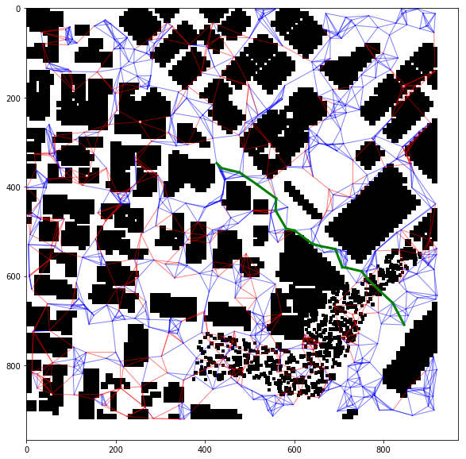
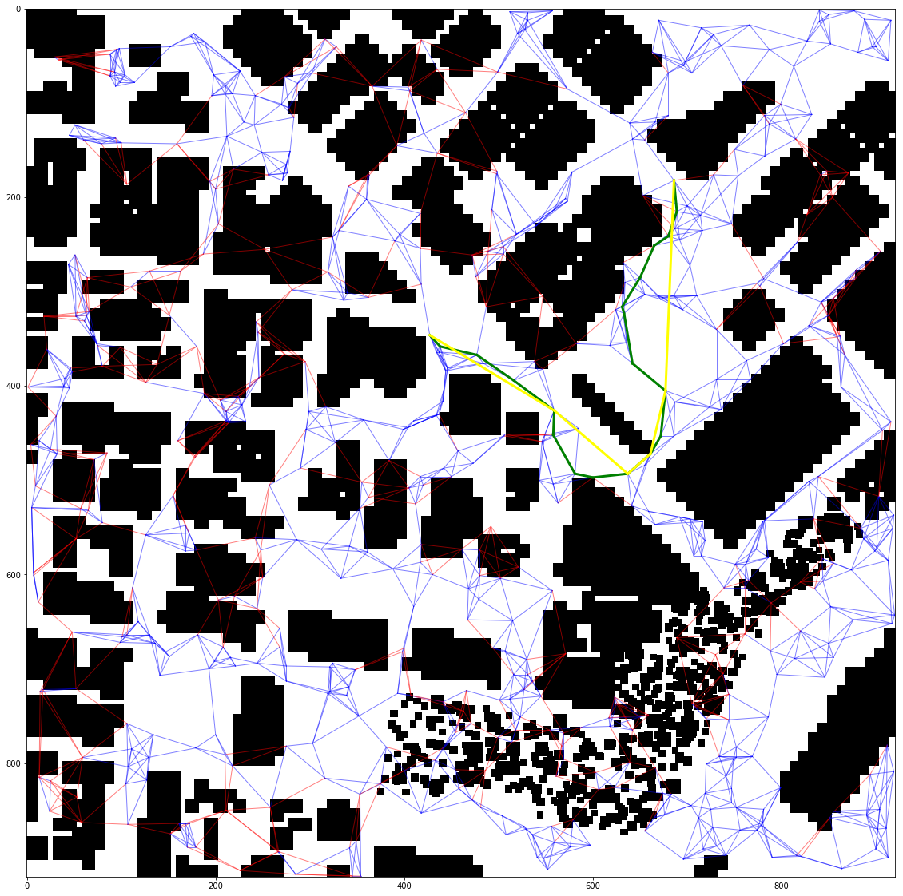

# 1. Explain the Starter Code

Tested ```motion_planning.py```. It is indeed similar to ```backyard_flyer_solution.py```. 

The main differences between these scripts:
- argument parser added
- ```plan_path(self)``` method, which will contain the path planning logic

A major complaint I have about ```motion_planning.py``` is that it starts inside the building and there is no way to change it. 


# 2. Implementing Path Planning Algorithm

## Setting home position
- In the first step ```ANCHOR``` variable is set to ```(lat0, lon0)``` value.
- Global home is set by ```self.set_home_position(*self.global_position)``` at the begining of the planning sequence

## Local to global coordinates
Local to global coordinate mapping is calculated this function (available in ```spejson.py```):
```python
def glob2loc(global_coords, anchor_global, anchor_local=[0,0]):
    easting_p, northing_p, _, _ = utm.from_latlon(position[1], position[0])
    easting_a, northing_a, _, _ = utm.from_latlon(anchor[1], anchor[0])

    lx = easting_p - easting_a
    ly = northing_p - northing_a

    # in case we don't start from map center
    lx -= anchor_local[0]
    ly -= anchor_local[1]

    return lx, ly
```

## Setting start & goal

Start:
```python
start = self.local_position
```

Goal:
```python
goal = global_to_local(goal_global, self.global_home)
```

## Graph generation


First, I randomly sample points in space using ```create_graph``` method:

``` python
def create_graph(points, bf=4, return_tree=False):
    """
    points: Nx3 array of sampled points 
    bf: branching factor
    """
```

Next, I prune the graph (using ```prune_graph``` method )
```python
prune_graph(graph, obstacles, copy_graph=True):
```

Finally, I find the closest points to the ```start``` and ```goal``` and ensure they are in a certain epsilon from the points. In retrospect, it would've been easier to just add ```start``` and ```goal``` as graph nodes.

```python
# find nodes closest to start and goal
(d1,d2),(s_idx,g_idx) = kd_tree.query([start, goal])

start_node = tuple(*points[s_idx])
goal_node = tuple(*points[g_idx])

assert start_node in graph
assert goal_node in graph
assert d1 < 10
assert d2 < 10
```

## A* search 
Since I'm using a graph representation, the diagonal motions are enabled (or arbitrary angle/length motions for that matter).

## Path prunning (ray tracing + collinearity check)

I'm using ray tracing to determine wheteher the edges are free of obstacles.

In the image below, the blue edges correspond to the feasible vertices and the red edges to infeasible ones.
The green edges correspond to the shortest path.



As an additional step, I check whether there exists an obstacle free edge between non-subsequent vertices of the graph (graph version of collinearity check).

The yellow edges in the image below illustrate the algorithm finding a shorter (pruned) path.




## Feeding ECEF waypoints

As the last step, I extend the path with heading coordinate, and feed it to the drone

```python
# extend path with attitude
path = [(p[0]+ox, p[1]+oy, p[2], 0) for p in path]

self.waypoints = path
self.target_position = path[0]
self.send_waypoints()
```

# Flight execution

The flight execution works.

However, the map is awfuly inconsistent with the 3D environment. Some buildings present in 3D environment are not present on map. This will eventually lead to collisions sometimes.